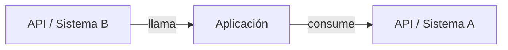

## Inyección automática

Esta regla se carga automáticamente con:
- `equipo/desarrollo/dev-ggs/` — siempre (para JSDoc, README, ADRs)
- `equipo/producto/arquitecto/` — siempre (para ADRs)
- `equipo/testing/unitario/` — cuando se escribe tests que documentan comportamiento
- `reglas/onboarding/` — se complementa con esta regla para documentación de proyecto

## Objetivo

La documentación no es burocracia — es empatía con el próximo developer (que probablemente sos vos en 6 meses).

## Reglas

1. **Documentar el "por qué", no el "qué"** — el código ya dice qué hace; el comentario agrega el por qué
2. **Comentario = deuda si describe código obvio** — `// suma 1 al contador` es ruido
3. **JSDoc para funciones públicas y utilidades** — cualquier función usada en más de un archivo
4. **README siempre actualizado** — si cambiás cómo se levanta el proyecto, actualizá en el mismo PR
5. **TODO con ticket** — `// TODO: AB#42 - mover lógica a servicio`; sin ticket se pierde para siempre
6. **Sin código comentado** — para eso existe git; borrarlo
7. **Documentar decisiones de arquitectura** — si elegiste librería X sobre Y, dejá una nota
8. **Trazabilidad de autoría en cambios de agente** — todo cambio de código realizado por un agente deja una marca `GGS-TRACE` mínima y buscable.

## Marca GGS-TRACE en código

La marca sirve para revisión y auditoría: permite saber si un bloque fue tocado por un agente o por una persona, cuál agente participó y qué work item lo originó.

Regla de oro: **una marca por archivo o bloque lógico modificado, no una marca por línea**. Si marcás cada línea, arruinás la legibilidad. La trazabilidad ayuda; el ruido molesta.

Formato estándar:

```text
GGS-TRACE: actor={agent|person}:{identificador}; workItem=AB#{ID}; reason={motivo breve}; date={YYYY-MM-DD}
```

Ejemplos por lenguaje:

```ts
// GGS-TRACE: actor=agent:equipo/desarrollo/dev-ggs; workItem=AB#142; reason=validación de alta de cliente; date=2026-04-17
```

```csharp
// GGS-TRACE: actor=agent:guilds/backend-dotnet; workItem=AB#151; reason=corrección regla de CUIT; date=2026-04-17
```

```sql
-- GGS-TRACE: actor=person:dev-equipo; workItem=AB#200; reason=índice para búsqueda por cliente; date=2026-04-17
```

```html
<!-- GGS-TRACE: actor=agent:equipo/diseno/ui; workItem=AB#177; reason=ajuste de accesibilidad; date=2026-04-17 -->
```

Dónde ponerla:
- En el encabezado del archivo si el agente creó el archivo completo.
- Encima del bloque, función, clase, migration, handler o componente modificado si el archivo ya existía.
- En README/ADR/changelogs solo si el contenido fue generado o actualizado por agente.

Dónde NO ponerla:
- No en cada línea.
- No dentro de código generado automáticamente.
- No en archivos de configuración con formato estricto si puede romper parsing.
- No para reemplazar comentarios útiles de dominio.
- No como atribución de commit ni `Co-Authored-By`.

Si el cambio lo hizo una persona, usar `actor=person:{rol-o-equipo}`. Si lo hizo un agente, usar `actor=agent:{ruta-del-agente}`.

## README obligatorio por proyecto

Todo README generado o actualizado por este agente debe incluir una sección **Mapa aplicativo**. El README no es decoración: es el plano de la casa. Sin mapa, nadie entiende cómo vive el sistema dentro del ecosistema.

Estructura mínima:

````markdown
## Mapa aplicativo

### Propósito del sistema
{Qué problema resuelve esta aplicación}

### Componentes internos
| Componente | Responsabilidad | Tecnología |
|------------|-----------------|------------|
| {componente} | {qué hace} | {stack} |

### Relaciones con otras APIs y sistemas
| Sistema/API | Dirección | Protocolo | Autenticación | Propósito | Criticidad |
|-------------|-----------|-----------|---------------|-----------|------------|
| {API externa/interna} | consume / expone | REST/gRPC/eventos | JWT/API Key/OAuth/etc. | {para qué} | alta/media/baja |

### Diagrama


### Riesgos de integración
- {timeout, rate limit, dependencia crítica, contrato inestable, datos sensibles}
````

Reglas:
- Si no se conocen relaciones externas, escribir explícitamente: `No se detectaron integraciones externas documentadas`.
- Si una API maneja datos sensibles, marcarlo en riesgos.
- Si hay contratos OpenAPI/Swagger, linkearlos.
- Si el sistema publica eventos o consume colas, incluirlos como relaciones aunque no sean APIs REST.

## Cuándo escribir JSDoc

```js
// ✅ Función compleja — documentar
/**
 * Calcula el precio final con descuento por cantidad y política vigente.
 *
 * @param {number} precioBase - Precio unitario sin descuentos
 * @param {number} cantidad - Cantidad de unidades
 * @returns {number} Precio final con descuentos aplicados
 *
 * @example
 * calcularPrecioFinal(1000, 5) // → 4500
 */
function calcularPrecioFinal(precioBase, cantidad) { ... }

// ❌ Función simple — NO documentar
function formatearFecha(fecha) {
  return fecha.toLocaleDateString('es-AR');
}
```

## Comentarios útiles vs. ruido

```js
// ❌ Ruido
// Incrementa el contador
ventasCount++;

// ✅ Útil — explica una decisión no obvia
// setTimeout(0) fuerza que el DOM se actualice antes de leer
// el alto del elemento. Ver issue #87.
setTimeout(() => calcularAlto(), 0);

// ✅ Útil — advierte un gotcha
// ATENCIÓN: la API devuelve precios en centavos, no en pesos.
const precio = apiResponse.monto * 0.01;
```

## Checklist de documentación en cada PR

- [ ] Funciones nuevas complejas tienen JSDoc
- [ ] Sin código comentado
- [ ] Sin TODOs sin ticket
- [ ] README actualizado si cambia el setup o los scripts
- [ ] Cambios de agente tienen marca `GGS-TRACE` donde corresponde
- [ ] README incluye `Mapa aplicativo` con relaciones a APIs, sistemas externos, eventos o colas
