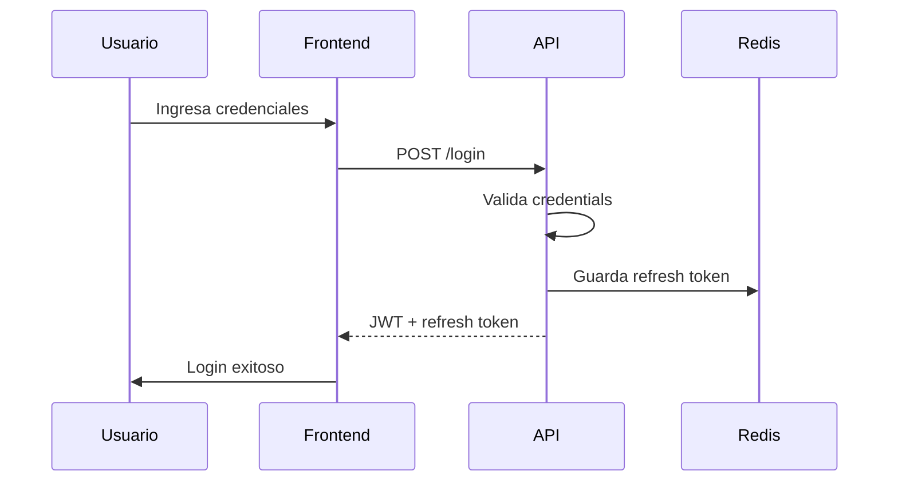

# Manuales Técnicos - Estándar GGSoluciones

Este skill define el formato para crear manuales técnicos directed a developers. A diferencia de las guías de desarrollo, los manuales técnicos profundizan en arquitectura, diseño y decisiones técnicas.

## Cuándo usar este skill

- Usuario dice: "manual técnico", "documentación de arquitectura", "diseño del sistema"
- Necesitás documentar la arquitectura de una solución completa
- Crear documentación para onboarding técnico

## Diferencia con otros documentos

| Documento | Qué Documenta | Audiencia |
|-----------|--------------|-----------|
| Guías | Procesos paso a paso | Desarrolladores |
| **Manuales técnicos** | Arquitectura, diseño, decisiones | Desarrolladores, Arquitectos |
| User manuals | Cómo usar una función | Usuarios finales |
| API docs | Endpoints, contratos | Desarrolladores |

## Estructura de un manual técnico

```markdown
# Manual Técnico - {Nombre del Sistema/Módulo}

## 1. Resumen ejecutivo
[Descripción breve del sistema: qué hace, para qué sirve, tecnologías]

## 2. Arquitectura
### 2.1 Diagrama de componentes
[Diagrama ASCII o descripción]

### 2.2 Capas
[Presentation, Application, Domain, Infrastructure]

### 2.3 Flujos principales
[Descripción de los flujos clave]

## 3. Modelo de datos
### 3.1 Entidades principales
[Tabla o descripción de entidades]

### 3.2 Relaciones
[Descripción de relaciones]

## 4. API / Contratos
[Endpoints principales, contratos]

## 5. Decisiones arquitectónicas (ADR)
[Lista de ADRs relevantes]

## 6. Configuración
[Variables de entorno, settings]

## 7. Seguridad
[Auth, permisos, consideraciones]

## 8. Deployment
[Cómo desplegar, infraestructura]

## 9. Testing
[Estrategia de testing]

## 10. Referencias
[Links a docs relacionados]
```

## Ejemplo: Manual de un módulo

```markdown
# Manual Técnico - Módulo de Autenticación

## 1. Resumen ejecutivo

El módulo de autenticación maneja el login, logout, gestión de sesiones y refresh tokens para todos los portales internos de GGSoluciones.

| Aspecto | Detalle |
|---------|---------|
| Tech stack | .NET 8, JWT, EF Core |
| Ubicación | `backend/Auth/` |
| Cliente | React + Vite |

## 2. Arquitectura

### 2.1 Diagrama de componentes

```
┌─────────────┐     ┌─────────────┐     ┌─────────────┐
│   Frontend  │────▶│  API Gateway │────▶│ Auth Module │
└─────────────┘     └─────────────┘     └─────────────┘
                                                 │
                    ┌─────────────┐              │
                    │   Redis     │◀─────────────┘
                    │  (Sessions) │
                    └─────────────┘
```

### 2.2 Capas

| Capa | Responsabilidad |
|------|-----------------|
| `Auth.Api` | Controllers, middlewares, JWT config |
| `Auth.Application` | Commands, Queries, DTOs |
| `Auth.Domain` | Entities, Value Objects, Interfaces |
| `Auth.Infrastructure` | EF Core, Redis, JWT Handler |

### 2.3 Flujos de autenticación

**Login flow:**
1. Frontend POST `/api/auth/login` con credentials
2. Validate credentials contra DB
3. Generate JWT + Refresh Token
4. Store Refresh Token en Redis (session)
5. Return JWT al cliente

**Refresh token flow:**
1. Frontend POST `/api/auth/refresh` con refresh token
2. Validate refresh token en Redis
3. Generate new JWT + new Refresh Token
4. Update Redis session
5. Return new JWT

**Logout flow:**
1. Frontend POST `/api/auth/logout`
2. Remove refresh token from Redis
3. Client clears JWT from localStorage

## 3. Modelo de datos

### 3.1 Entidades

```
Usuario
├── Id (Guid)
├── Email (string)
├── PasswordHash (string)
├── Nombre (string)
├── Apellido (string)
├── Rol (enum: Admin, Vendedor, Gerente)
├── Activo (bool)
├── CreatedAt (DateTime)
└── UpdatedAt (DateTime)

RefreshToken
├── Id (Guid)
├── UsuarioId (Guid)
├── Token (string)
├── ExpiresAt (DateTime)
└── RevokedAt (DateTime?)
```

### 3.2 Relaciones

- Usuario 1 → N RefreshToken
- Un usuario puede tener múltiples refresh tokens activos

## 4. API

### Endpoints

| Método | Ruta | Descripción |
|--------|------|-------------|
| POST | `/api/auth/login` | Iniciar sesión |
| POST | `/api/auth/logout` | Cerrar sesión |
| POST | `/api/auth/refresh` | Renovar token |
| GET | `/api/auth/me` | Obtener usuario actual |
| POST | `/api/auth/change-password` | Cambiar contraseña |

### Contratos

**POST /api/auth/login**
```json
// Request
{
  "email": "usuario@example.com",
  "password": "contraseña"
}

// Response 200
{
  "token": "eyJhbG...",
  "refreshToken": "dGhpcy...",
  "expiresIn": 3600,
  "user": {
    "id": "guid",
    "email": "usuario@example.com",
    "nombre": "Usuario",
    "apellido": "Apellido",
    "rol": "Vendedor"
  }
}
```

## 5. Decisiones arquitectónicas (ADR)

### ADR-001: JWT con Refresh Tokens

- **Contexto**: Necesitábamos auth stateless
- **Decisión**: Usar JWT access tokens (15 min) + refresh tokens (7 días) almacenados en Redis
- **Consecuencias**: Requiere Redis, necesita endpoint de refresh

### ADR-002: Password hashing con BCrypt

- **Contexto**: Seguridad de credenciales
- **Decisión**: BCrypt con cost factor 12
- **Consecuencias**: Hashing slower pero más seguro

## 6. Configuración

### appsettings.json

```json
{
  "Auth": {
    "Jwt": {
      "Key": "${JWT_SECRET}",
      "Issuer": "ElCuatro API",
      "Audience": "ElCuatro Frontend",
      "ExpiryMinutes": 15
    },
    "RefreshToken": {
      "ExpiryDays": 7
    }
  }
}
```

### Variables de entorno

| Variable | Descripción |
|----------|-------------|
| `JWT_SECRET` | Clave para firmar JWTs (min 32 chars) |
| `REDIS_CONNECTION` | Connection string de Redis |

## 7. Seguridad

- Passwords hasheados con BCrypt (cost 12)
- JWT con expiración corta (15 min)
- Refresh tokens rotados en cada uso
- Rate limiting en endpoints de auth
- Logs sin información sensible

## 8. Deployment

### Requisitos
- .NET 8 runtime
- Redis (Azure Cache o container)
- SQL Server

### Pasos
1. Publicar API: `dotnet publish`
2. Configurar vars de entorno
3. Correr migración: `dotnet ef database update`
4. Verificar Redis connectivity
5. Deploy a App Service / Contenedor

## 9. Testing

| Tipo | Herramienta | Cobertura objetivo |
|------|-------------|---------------------|
| Unit | xUnit + FluentAssertions | 80% |
| Integration | WebApplicationFactory | Core flows |
| E2E | Playwright | Happy paths |

## 10. Referencias

- [Código fuente](link)
- [ADR-001](../adr/001-jwt-refresh-tokens.md)
- [Wiki de equipo](link)
- [Contacto: Arquitectura](mailto:)
```

## Diagrams (Mermaid soportado)

```markdown
## Diagrama de secuencia


```

## Checklist de entrega

- [ ] Resumen ejecutivo claro (qué, para qué, tech stack)
- [ ] Diagrama de arquitectura (ASCII o Mermaid)
- [ ] Descripción de capas
- [ ] Flujos principales explicados
- [ ] Modelo de datos con entidades y relaciones
- [ ] API contracts con ejemplos reales
- [ ] ADRs referenciados o incluidos
- [ ] Configuración documentada (settings + env vars)
- [ ] Sección de seguridad
- [ ] Guía de deployment
- [ ] Estrategia de testing
- [ ] Referencias a código y docs relacionados
